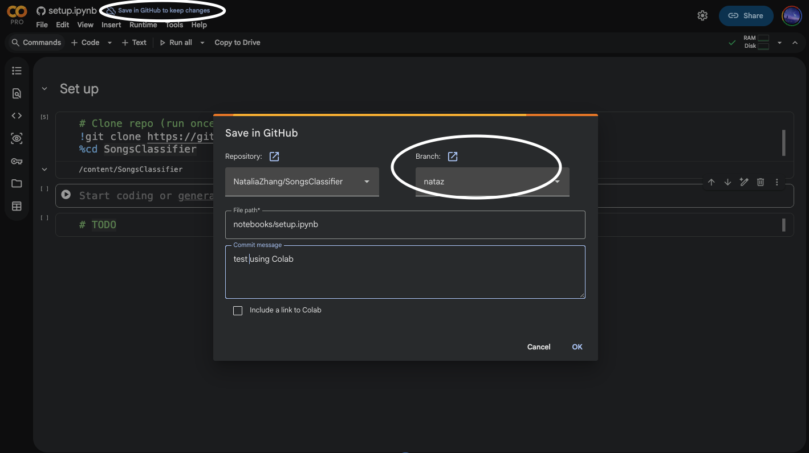

# Project_1 – Team Workflow (GitHub + Google Colab)

---

## 0. Source of Truth
- **Code, notebooks, and LaTeX** live on **GitHub**
- **Large data, checkpoints, and outputs** live on **Google Drive**
- `main` branch should always run. Don't break it!

---

## 1. Repository Structure
- Put real logic in `src/`
- Notebooks should mostly import from `src/`. Keep them lightweight.
- Use `latex/` for our report
- Use `.gitignore` to exclude large files and checkpoints from GitHub. 

## 2. Branching Rules
- `main` should be stable, runnable: Do not push directly to main.
- One branch per person: only work on your branch, then merge to main when ready. List your banch here:
  - Natalia Zhang: `nataz`
  - Chengrui Qu:
  - Chengyi Liu:
  - Mengzhan Liufu: `mliufu`

### Basic Github Workflow
```bash
# start working
git checkout main
git pull origin main
git checkout -b your-name
git merge main

# during work
git add .
git commit -m "Your message"

# push and sync with main
git push    # at your own branch
git checkout main
git pull    # from main branch
git merge your-name
git push    # at main branch
```

### Colab Workflow
First cell in Colab:
```python
# Clone the repo (only first time)
!git clone https://github.com/NataliaZhang/SongsClassifier.git
%cd SongsClassifier
!pip install -r requirements.txt
```

Example figure saving notebook in google colab and pushing to Github:

